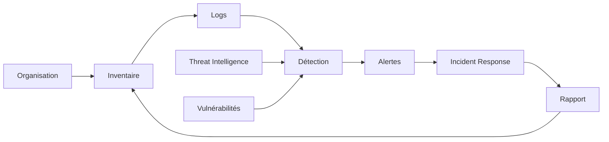

# HashCode CyberShield

> Plateforme de cybersécurité accessible aux organisations africaines : visibilité, détection, vulnérabilités, renseignement et réponse.

**Domaine:** Cybersecurity · **Programme:** HashCode Global Impact · **Statut:** Research / MVP discovery

## Problème
Les petites organisations disposent souvent de moins de ressources pour surveiller leurs actifs, détecter les attaques et répondre aux incidents.

## Vision
Assembler une pile de sécurité modulaire, déployable progressivement et adaptée aux environnements à faibles ressources.

## Cartographie

## MVP
Inventaire, collecte de logs, règles de détection, vulnérabilités, alertes, playbooks et rapports.

## Sécurité
Minimisation des données, contrôle d'accès, rétention maîtrisée et usage exclusivement autorisé. Le projet ne fournit pas de capacités offensives non autorisées.

## Impact
Organisations protégées, actifs couverts, temps de détection, temps de réponse et réduction des expositions critiques.

## Contribuer
Voir : https://github.com/HashCode-Reboot/hashcode-contributors

**Doctrine HashCode:** *Build for Africa. Scale for Humanity.*