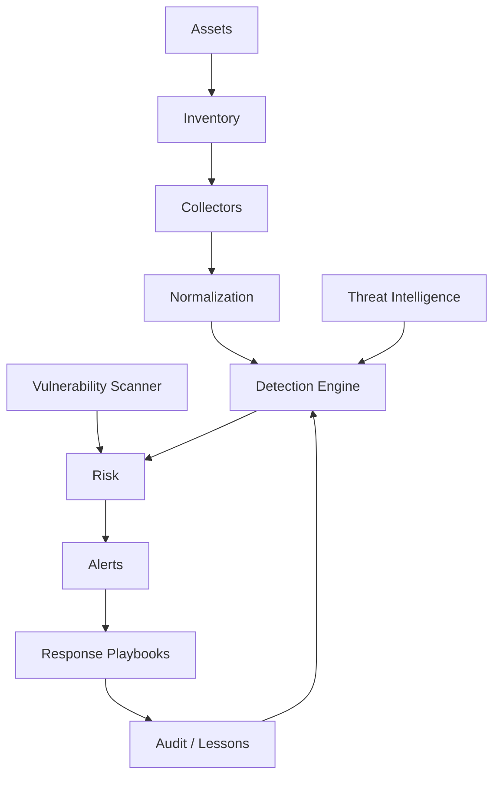

# Architecture — CyberShield

## Principes

Architecture modulaire, agents légers, chiffrement en transit et au repos, RBAC, journalisation, signatures/version des règles et déploiement progressif.

Le projet est défensif : aucune automatisation offensive non autorisée ne fait partie du périmètre.